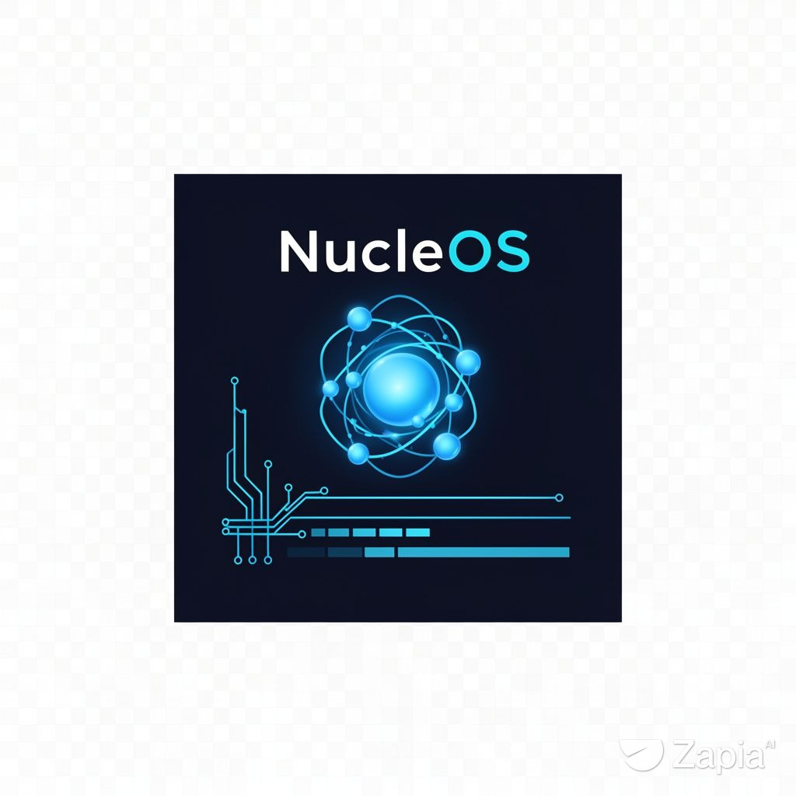

# NucleOS

<p align="center">
  
</p>


NucleOS es un sistema operativo experimental para x86_64, escrito
principalmente en C y ensamblador. El proyecto estudia la implementación de un
kernel, un sistema de archivos, procesos, una ABI de usuario y herramientas
POSIX sobre una plataforma controlada y reproducible.

El proyecto arranca mediante GRUB Multiboot v1 y se ejecuta actualmente en
QEMU x86_64. No debe considerarse todavía un sistema operativo de uso general.

> El proyecto se conocía anteriormente como [cris-os-v2](https://github.com/CRISTOP-bot/cris-os-v2).

## Estado del proyecto

La siguiente tabla distingue entre código verificado, código integrado como
fuente y trabajo pendiente. La presencia de una fuente o de una interfaz no
implica que el componente ya funcione como programa dentro de NucleOS.

| Área | Estado |
|---|---|
| Arranque GRUB Multiboot v1 en x86_64 | Implementado y compilado en CI |
| Consola VGA, puerto serie, teclado y mouse PS/2 | Implementación experimental |
| PMM, VMM inicial y heap | Implementación experimental |
| VFS y rootfs cargado como módulo Multiboot | Implementación experimental |
| Shell integrado y aplicaciones TUI | Implementación experimental |
| ELF estático y libc inicial | Parcial; apto únicamente para pruebas pequeñas |
| `stat`, `fcntl` y `waitpid` | ABI inicial con smoke test de compilación |
| Bash 5.3 | Fuente integrada; binario NucleOS pendiente |
| OpenRC | Fuente integrada; binarios NucleOS pendientes |
| Fastfetch | Fuente integrada; binario NucleOS pendiente |
| AArch64 | Boot temprano con FDT, MMU y base de IRQ; no kernel completo |
| ARMv7 | Boot temprano con vectores y UART; no kernel completo |
| i386 | Preparado para port; todavía no arrancable |

### Componentes que aún no están disponibles

Todavía faltan memoria aislada por proceso, herencia completa de descriptores,
TTY, señales, job control, un loader ELF completo, librerías dinámicas y una
libc POSIX suficientemente amplia. Por tanto, Bash, OpenRC y Fastfetch no se
instalan todavía como binarios ejecutables en el rootfs.

No se incluyen binarios compilados para Linux haciéndolos pasar por binarios de
NucleOS.

## Perfil técnico actual

- Arquitectura arrancable: x86_64.
- Bootloader: GRUB Multiboot v1.
- Kernel: freestanding C/ASM, sin libc del host.
- Entrada: `kernel/arch/x86_64/boot.S`.
- Linker script: `kernel/linker.ld`.
- Rootfs: módulo Multiboot generado desde `rootfs/`.
- Build: Make y artefactos separados en `build/` y `dist/`.
- Emulador de referencia: `qemu-system-x86_64`.
- CI: compilación del kernel, validación Multiboot, generación de ISO y
  smoke test diagnóstico.

La base multi-arquitectura se documenta en
[`docs/ARCHITECTURES.md`](docs/ARCHITECTURES.md). Actualmente solo x86_64
genera la imagen principal de NucleOS.

El port AArch64 ya tiene una primera imagen independiente para QEMU `virt`:
configura el stack, analiza el FDT, instala la MMU, prepara el GICv2 y programa
el Generic Timer. Todavía no es el kernel completo ni comparte el build x86_64.

```bash
make aarch64-early \
  AARCH64_CC=aarch64-linux-gnu-gcc \
  AARCH64_LD=aarch64-linux-gnu-ld

make aarch64-run \
  AARCH64_CC=aarch64-linux-gnu-gcc \
  AARCH64_LD=aarch64-linux-gnu-ld \
  QEMU_AARCH64=qemu-system-aarch64
```

ARMv7 también tiene una imagen independiente de boot temprano para QEMU
`virt`, con tabla de excepciones, `VBAR`, UART PL011 y validación inicial del
DTB. Todavía no comparte el kernel completo ni declara soporte de usuario.

```bash
make armv7-early \
  ARMV7_CC=arm-linux-gnueabihf-gcc \
  ARMV7_LD=arm-linux-gnueabihf-ld

make armv7-run \
  ARMV7_CC=arm-linux-gnueabihf-gcc \
  ARMV7_LD=arm-linux-gnueabihf-ld \
  QEMU_ARMV7=qemu-system-arm
```

## Arquitectura del sistema

```text
GRUB Multiboot v1
        |
        v
kernel/arch/x86_64/boot.S
  32 bits -> long mode -> page tables iniciales
        |
        v
kmain()
  +-- GDT / IDT
  +-- PIC / PIT
  +-- PMM / VMM / heap
  +-- PCI y drivers PS/2
  +-- rootfs y VFS
  +-- procesos, syscalls y ELF inicial
  +-- shell y servicios provisionales
```

El código común está en `kernel/core/`. El código específico de arquitectura
se encuentra en `kernel/arch/`. Esta separación es necesaria para incorporar
posteriormente i386, ARMv7 y AArch64 sin reutilizar instrucciones x86 de forma
incorrecta.

## Requisitos

Para compilar y ejecutar la ISO x86_64 se necesitan, como mínimo:

| Herramienta | Uso |
|---|---|
| `gcc` | Compilación C freestanding |
| `binutils` (`ld`) | Ensamblado y enlace |
| `make` | Automatización del build |
| `rustc` | Módulo Rust freestanding |
| `grub-file` | Validación Multiboot |
| `grub-mkrescue` | Creación de la ISO |
| `xorriso` y `mtools` | Dependencias de GRUB |
| `python3` | Construcción del rootfs |
| `qemu-system-x86_64` | Emulación y smoke tests |

Para instalar dependencias en sistemas compatibles:

```bash
# Dependencias de build x86_64 + AArch64 + ARMv7
bash tools/setup/install-deps.sh

# Comprobar sin instalar; devuelve código 1 si falta algo
bash tools/setup/install-deps.sh --check

# Incluir además las herramientas para instalar NucleOS en un disco
bash tools/setup/install-deps.sh --with-installer
```

En Windows puedes usar `tools\\setup\\install-deps.bat --check` o
`tools\\setup\\install-deps.bat --yes`. Para ARM, el instalador prioriza WSL
cuando está disponible y ejecuta la copia local del script, sin descargar
scripts remotos.

Termux también está soportado para un perfil reducido de compilación y QEMU:
usa `pkg` y detecta `clang` como sustituto de `gcc`. La creación de la ISO
GRUB y las toolchains GNU ARM completas deben hacerse desde Linux, WSL o CI.
En Termux, cuando corresponda, puedes invocar el build con:

```bash
make CC=clang AS=clang
```

La instalación en disco requiere además herramientas como `grub-install`,
`blkid`, `partprobe`, `sgdisk`, `wipefs`, `mkfs.ext2` y `mkfs.fat`. El script
de instalación puede modificar particiones: úsalo únicamente sobre un disco
de prueba y después de verificar el dispositivo seleccionado.

## Preparación del repositorio

Los componentes externos se mantienen como submódulos y conservan sus
licencias originales:

```bash
git submodule update --init --recursive
make bash-source
make openrc-source
make fastfetch-source
```

La política de licencias está en
[`THIRD_PARTY_LICENSES.md`](THIRD_PARTY_LICENSES.md).

## Compilación y ejecución

### Kernel e ISO

```bash
# Mostrar los ports declarados
make arch-list

# Validar el port arrancable actual
make check-arch ARCH=x86_64

# Limpiar artefactos anteriores
make ARCH=x86_64 clean

# Compilar el kernel
make ARCH=x86_64 -j"$(nproc)"

# Construir kernel, rootfs e instalador en build/iso/
make ARCH=x86_64 iso

# Generar la ISO final en dist/os.iso
make ARCH=x86_64 echo-iso

# Generar la ISO y ejecutarla en QEMU
make ARCH=x86_64 run
```

La ISO generada se encuentra en:

```text
dist/os.iso
```

Para ejecutarla manualmente:

```bash
qemu-system-x86_64 -cdrom dist/os.iso -m 512M
```

### ABI y programas de usuario

```bash
# Compilar la libc inicial y crt0
make user-libc

# Compilar el ELF de prueba básico
make user-test-hello

# Compilar el smoke test de stat, fcntl y waitpid
make user-test-posix
```

Estos targets verifican compilación y enlace. No significan que todos los
programas ya puedan ejecutarse de forma segura dentro de NucleOS.

### Arquitecturas no disponibles todavía

Los siguientes comandos deben fallar de forma explícita hasta que se complete
cada port:

```bash
make ARCH=i386
make ARCH=aarch64
make ARCH=armv7
```

Consultar [`docs/ARCHITECTURES.md`](docs/ARCHITECTURES.md) para los requisitos
de cada arquitectura.

## Depuración con QEMU

```bash
# Ver la salida del puerto serie en la terminal
qemu-system-x86_64 \
  -cdrom dist/os.iso \
  -m 512M \
  -serial stdio

# Registrar interrupciones y evitar reinicios automáticos
qemu-system-x86_64 \
  -cdrom dist/os.iso \
  -m 512M \
  -serial stdio \
  -d int \
  -no-reboot

# Smoke test con logs separados
mkdir -p build
timeout --foreground 35s \
  qemu-system-x86_64 \
  -cdrom dist/os.iso \
  -m 512M \
  -display none \
  -serial file:build/qemu-serial.log \
  -monitor none \
  -no-reboot \
  -no-shutdown \
  -d guest_errors,unimp,pcall,cpu_reset \
  -D build/qemu-debug.log || true

cat build/qemu-serial.log
cat build/qemu-debug.log
```

La CI conserva los logs del smoke test. Mientras el kernel no tenga una
instrucción de apagado para QEMU, el timeout puede ser normal; el marcador de
arranque serial se usa únicamente como diagnóstico y todavía no bloquea el
workflow.

## Instalación en USB o disco

Para consultar las instrucciones sin modificar ningún dispositivo:

```bash
make installer
make installer-usb
```

Para crear un USB se debe proporcionar el dispositivo correcto. El comando
puede borrar todos sus datos:

```bash
sudo bash tools/media/make-usb.sh /dev/sdX
```

Para ejecutar el instalador desde un USB o ISO montado:

```bash
sudo python3 /mnt/installer/nucleos-install
```

Para ejecutarlo desde el repositorio:

```bash
sudo tools/installer/nucleos-install
```

Realiza una copia de seguridad y confirma siempre la ruta del dispositivo antes
de usar estas operaciones.

## Comandos del shell

El shell actual es una interfaz integrada en el kernel; no es Bash. La lista
incluye comandos experimentales y funciones que todavía pueden ser parciales.

| Comando | Función |
|---|---|
| `help` | Muestra la ayuda del shell |
| `fastfetch` | Muestra información básica del sistema; implementación provisional |
| `gui` | Inicia la interfaz gráfica experimental |
| `ls`, `tree` | Lista archivos y directorios |
| `pwd`, `cd` | Consulta y cambia el directorio actual |
| `mkdir`, `rmdir`, `touch` | Operaciones básicas de directorios y archivos |
| `rm`, `cp`, `mv` | Elimina, copia y mueve archivos |
| `cat`, `grep`, `echo` | Consulta y procesa texto |
| `stat`, `df` | Muestra metadatos y uso del sistema de archivos |
| `clear`, `uname`, `whoami` | Información y control básico de la consola |
| `kblayout`, `mouse` | Configuración y estado de dispositivos de entrada |
| `hexdump`, `wc`, `head`, `tail` | Herramientas de texto y diagnóstico |
| `calc`, `calc-tui`, `asm` | Calculadoras y pruebas de ensamblador |
| `openrc` | Gestor de servicios provisional |
| `lcp` | Gestor de paquetes experimental |
| `proc`, `ps`, `meminfo`, `uptime` | Información de procesos, memoria y tiempo |
| `persist` | Almacenamiento persistente experimental |
| `net` | Estado y pruebas de red experimentales |
| `lspci` | Enumeración de dispositivos PCI |
| `games` | Menú de juegos experimentales |
| `nano`, `hexview`, `files`, `htop`, `sysinfo` | Aplicaciones TUI |
| `reboot` | Reinicia la máquina virtual |
| `panic` | Provoca un kernel panic para depuración |

## Referencia del Makefile

| Target | Descripción |
|---|---|
| `all` | Compila `build/kernel.bin`. |
| `check-arch` | Verifica que `ARCH` tenga un port implementado. |
| `arch-list` | Muestra las arquitecturas declaradas y su estado. |
| `iso` | Compila kernel, rootfs e instalador en `build/iso/`. |
| `echo-iso` | Construye `dist/os.iso` mediante `grub-mkrescue`. |
| `run` | Construye la ISO y la ejecuta con QEMU. |
| `user-libc` | Compila la libc inicial y `crt0`. |
| `user-test-hello` | Compila el ELF de prueba básico. |
| `user-test-posix` | Compila el smoke test de la ABI POSIX inicial. |
| `aarch64-early` | Compila la imagen independiente de boot temprano AArch64. |
| `aarch64-run` | Ejecuta la imagen temprana AArch64 en QEMU `virt`. |
| `bash-source` | Valida el submódulo de Bash 5.3. |
| `openrc-source` | Valida el submódulo oficial de OpenRC. |
| `fastfetch-source` | Valida el submódulo oficial de Fastfetch. |
| `installer` | Muestra instrucciones del instalador. |
| `installer-usb` | Muestra instrucciones para crear un USB. |
| `clean` | Elimina `build/` y `dist/`. |

Ejemplos con selección explícita de arquitectura:

```bash
make ARCH=x86_64
make ARCH=x86_64 echo-iso
make ARCH=i386       # aún no implementado
make ARCH=aarch64    # aún no implementado
make ARCH=armv7      # aún no implementado
```

## Estructura del repositorio

```text
kernel/
  arch/x86_64/       Código de arranque y ensamblador x86_64
  core/              Kernel, VFS, procesos, syscalls y shell
  drivers/           Drivers de consola, teclado, mouse, PIC y PIT
  linker.ld          Script de enlace
config/grub/         Configuración de GRUB e ISO
rootfs/              Contenido empaquetado como módulo Multiboot
user/                crt0, libc inicial y pruebas de ABI
tools/build/         Constructor del rootfs
tools/installer/      Instalador y componentes Python
tools/lcp/           Cliente LCP y repositorio principal
tools/media/         Herramientas de medios extraíbles
tools/setup/         Instaladores de dependencias
third_party/         Submódulos externos sin modificar
docs/                Arquitectura, ports y estado del proyecto
build/               Artefactos temporales ignorados por Git
dist/                ISO y sumas ignoradas por Git
```

Documentos principales:

- [`docs/ARCHITECTURES.md`](docs/ARCHITECTURES.md)
- [`docs/USERSPACE_PORT.md`](docs/USERSPACE_PORT.md)
- [`docs/BASH_PORT.md`](docs/BASH_PORT.md)
- [`docs/OPENRC_PORT.md`](docs/OPENRC_PORT.md)
- [`docs/IMPLEMENTATION_PLAN.md`](docs/IMPLEMENTATION_PLAN.md)
- [`docs/PROJECT_LAYOUT.md`](docs/PROJECT_LAYOUT.md)

## Limpieza

```bash
make clean
```

El comando elimina únicamente `build/` y `dist/`. Los submódulos y el código
fuente no se modifican.

## Licencia

El código propio de NucleOS se distribuye bajo la GNU General Public License
v3.0. Los componentes externos conservan sus licencias originales:

- GNU Bash: GPL-3.0.
- OpenRC: BSD-2-Clause.
- Fastfetch: MIT.

Consultar [`LICENSE`](LICENSE), [`LICENSE.md`](LICENSE.md),
[`COPYRIGHT.md`](COPYRIGHT.md) y
[`THIRD_PARTY_LICENSES.md`](THIRD_PARTY_LICENSES.md) para los avisos completos.
